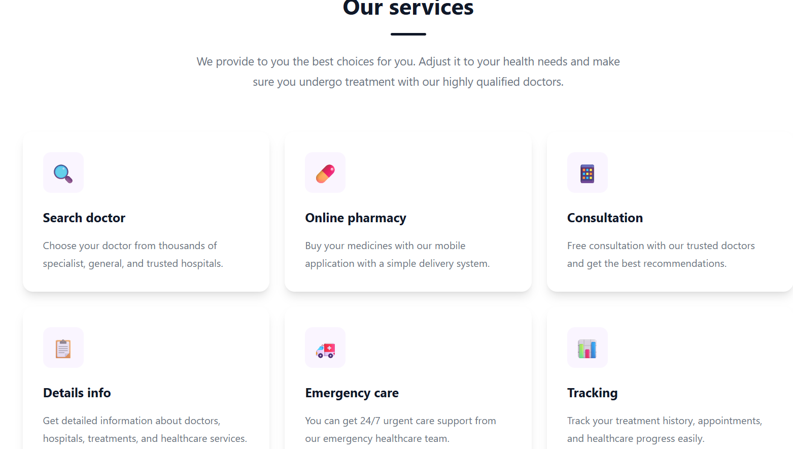
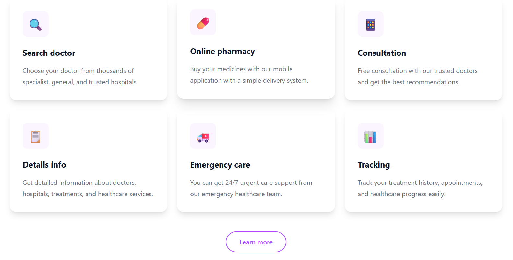
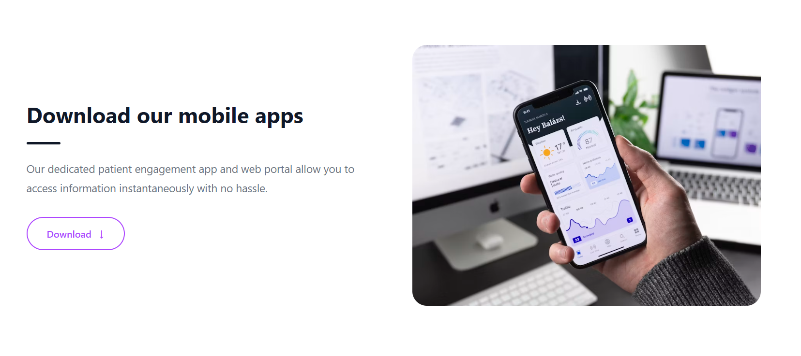

Live demo:https://priya15-47.github.io/trafalgar/

Trafalgar Landing Page

A responsive healthcare landing page built using HTML, JavaScript, Tailwind CSS, and Vite.

🚀 Live Demo:(https://priya15-47.github.io/trafalgar/)

✨ Features

\- Responsive navigation bar

\- Hero section

\- Services section

\- Healthcare providers section

\- Mobile application section

\- Testimonials section

\- Latest articles section

\- Responsive footer

\- Fully responsive design (Mobile, Tablet, Desktop)

\- Modern UI design

Add some screenshots:

🛠️ Technologies Used

\- HTML5

\- JavaScript

\- Tailwind CSS

\- Vite

📂 Project Structure

trafalgar/

│

├── images/

│   ├── about.png

│   ├── apps.png

│   ├── article.png

│   ├── home.png

│   ├── service.png

│   └── services.png

│

├── src/

│   ├── components/

│   │   ├── Navbar.js

│   │   ├── Hero.js

│   │   ├── Services.js

│   │   ├── Providers.js

│   │   ├── Apps.js

│   │   ├── Testimonials.js

│   │   ├── Articles.js

│   │   └── Footer.js

│   │

│   ├── input.css

│   ├── output.css

│   └── main.js

│

├── index.html

├── package.json

├── package-lock.json

├── README.md

└── .gitignore

👩‍💻 Author:Fatema Akter Priya

GitHub: https://github.com/priya15-47/

